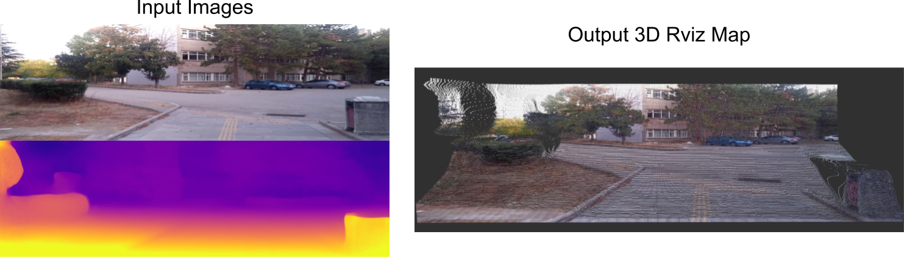

# 3D-visualization-of-depth-maps
3D ROS visualization of depth maps which are created by any depth model such as Monodepth, Packnet, etc.. All steps including build are written one by one. To build source code, **catkin** is used. All required links are added to references. 

## 1 Requirements
- ROS (tests are made with Kinetic)

## 2 Change input folder path
Change 1 variables in source code (constructing_map.cpp):

```
image_folder_root_path : contains depth maps and rgb images
    - kitti_tiny_0000000000_depth.png
    - kitti_tiny_0000000000_rgb.png
    - kitti_tiny_0000000001_depth.png
    - kitti_tiny_0000000001_rgb.png
    ...
    - kitti_tiny_0000000067_depth.png
    - kitti_tiny_0000000067_rgb.png
    ...
counter_image: number of images in image_folder_root_path
```

## 3 Build
### 3.1 create a workspace folder and create catkin workspace
```
mkdir -p ~/catkin_ws/src
cd ~/catkin_ws/
source /opt/ros/kinetic/setup.bash 
catkin_make
```

### 3.2 Two folder should be created with *catkin_make* command: "build, devel". `src` folder contains all packages. Hence, we should create a package in `src`. 

```
cd src
catkin_create_pkg visualize_depth_map roscpp visualization_msgs
```

### 3.3 `visualize_depth_map` folder should be created. 

#### 3.3.1 Change CMakeLists file
Add these lines to ~/Catkin_ws/src/visualize_depth_map/CMakeLists.txt

```
add_executable(constructing_map src/constructing_map.cpp)
target_link_libraries(constructing_map ${catkin_LIBRARIES})

find_package(OpenCV REQUIRED)
include_directories(${OpenCV_INCLUDE_DIRS})
target_link_libraries(constructing_map ${OpenCV_LIBS})
```

#### 3.3.2 Build now
```
cd visualize_depth_map/src
cp ~/Downloads/3D-ros-visualization-of-depth-maps-master/src/constructing_map.cpp .
cd ~/catkin_ws
catkin_make
```

### 3.4 Build is done! Let's try: Open 3 Terminal

1. Terminal
```
source /opt/ros/kinetic/setup.bash 
roscore
```

2. Terminal
```
source /opt/ros/kinetic/setup.bash 
rosrun rviz rviz 
```

3. Terminal
```
source 
rosrun visualize_depth_map constructing_map.cpp <first frame number> <frequence of frame (unit : Hertz)>
```

Example:
```python
# means starting from first frame and 30 frame per second
rosrun visualize_depth_map constructing_map.cpp 0 30 
```

## 4 Roslaunch option:
Launch files are configuration files that help us to open 3 different terminal separately. Instead, we just open 1 terminal and run laundh file, it starts all necessary file and show in a single terminal. Even if 'roscore' is not opened, launch file runs a terminal for roscore. 

Back to 

## 5 References
- [Creating catkin workspace](http://wiki.ros.org/catkin/Tutorials/create_a_workspace)
- [Creating catkin package](http://wiki.ros.org/ROS/Tutorials/catkin/CreatingPackage)
- [Ros RViz Tutorial](http://wiki.ros.org/rviz/Tutorials/Markers%3A_Points_and_Lines)
- How to extract depth maps?
    - [Monodepthv2](https://github.com/nianticlabs/monodepth2)
    - [PackNet-sfm](https://github.com/TRI-ML/packnet-sfm)